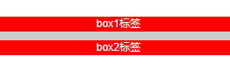
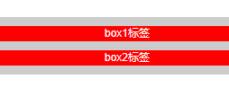
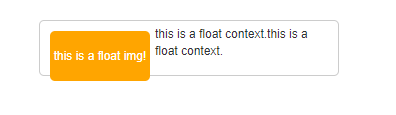
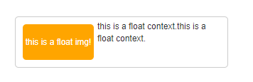
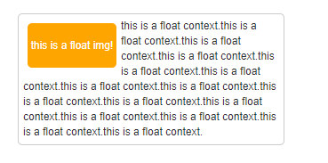
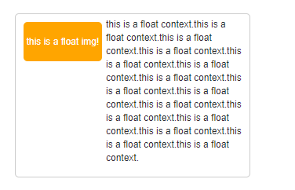

### BFC的理解

##### 什么是BFC（Block formatting contexts）

> w3c规范中BFC定义：
>
> 浮动元素和绝对定位元素，非块级盒子的块级容器（例如`inline-blocks`，`table-cells`和`table-captions`），以及`overflow`值不为“`visiable`”的块级盒子，都会为他们的内容创建新的BFC（块级格式上下文）。
>
> 在BFC中，盒子从顶端开始垂直地一个接一个地排列，两个盒子之间的垂直的间隙是由他们的margin 值所决定的。在一个BFC中，两个相邻的块级盒子的垂直外边距会产生折叠。
>
> 在BFC中，每一个盒子的左外边缘（margin-left）会触碰到容器的左边缘(border-left)（对于从右到左的格式来说，则触碰到右边缘）。
>
> 原文: 
>
> https://www.w3cplus.com/css/understanding-bfc-and-margin-collapse.html
>
>  © 
>
> w3cplus.com

##### 如何创建BFC

- 设置`overflow`的值不为`visiable`。
- 使用float（浮动）来创建一个BFC。
- 使用`position:absolute`或者`position:fixed`
- 使用`display:inline-block`、`display:table-cell`或者`display:table-caption`，其中`table-cell`和`table-caption`是表格相关元素对应默认CSS值，所以当你创建表格时，对应的每个单元格都会自动创建BFC。
- 使用多列布局`column-span:all`也可以创建BFC。
- 使用`display:flow-root`

##### BFC能做什么

1. 使用BFC来防止外边距折叠。

   ```html
   <div class="box">
   		<p>box1标签</p>
   		<p>box2标签</p>
   </div>
   <style>
   	.box{
           background-color: #ccc;
           margin: 0 0 40px 0;
   	}
       .box p{
           padding:0;
           margin:10px 0 10px 0;
           background:red;
           color:#fff;
       }
   </style>
   ```

   效果：

   

   *由于`p`元素的边缘与`.box`元素边缘不存在`padding`和`border`，所以`p`元素与`.box`元素紧密相连，`p`元素设置的`margin`属性与外部的`.box`的`margin`相重叠，`p`元素会与`.box`元素的顶部底部齐平，两个`p`元素中间又根据`margin`叠加计算规则得出10px。*

   ```html
   <div class="box">
   		<p>box1标签</p>
   		<p>box2标签</p>
   </div>
   <style>
   	.box{
           background-color: #ccc;
           margin: 0 0 40px 0;
           overflow: auto;
   	}
       .box p{
           padding:0;
           margin:10px 0 10px 0;
           background:red;
           color:#fff;
       }
   </style>
   ```

   效果：

   

   通过`overflow`创建BFC，可以将p元素的`margin`包裹在BFC内部。

2. 使用BFC来包含浮动。

   ```html
   <div class="float">
   		<div class="floatimg">this is a float img!</div>
   		<p>this is a float context.this is a float context.</p>
   </div>
   <style>
   	.float{
           width:300px;
           padding:5px;
           border:1px solid #ccc;
           border-radius: 5px;
           margin:auto;
   	}
       .floatimg{
           float:left;
           width:100px;
           height:50px;
           margin:5px;
           line-height: 50px;
           color:#fff;
           text-align: center;
           background:orange;
           border-radius: 5px;
       }
   </style>
   ```

   效果：

   

   *父容器的高度取决于文本的高度，它将不会包含已经浮动的子元素。可以通过给容器设置`overflow:hidden`，在容器中创建一个新的BFC。*

   ```html
   <div class="float">
   		<div class="floatimg">this is a float img!</div>
   		<p>this is a float context.this is a float context.</p>
   </div>
   <style>
   	.float{
           width:300px;
           padding:5px;
           border:1px solid #ccc;
           border-radius: 5px;
           margin:auto;
           overflow: auto; /*创建BFC*/
   	}
       .floatimg{
           float:left;
           width:100px;
           height:50px;
           margin:5px;
           line-height: 50px;
           color:#fff;
           text-align: center;
           background:orange;
           border-radius: 5px;
       }
   </style>
   ```

   效果：

   

3. 使用BFC来防止文字环绕。


   ```html
   <div class="float">
   	<div class="floatimg">this is a float img!</div>
   	<p>
       this is a float context.this is a float context.this is a float context.this is a float        context.this is a float context.this is a float context.this is a float context.this is a 			float context.this is a float context.this is a float context.this is a float context.this is a float context.this is a float context.this is a float context.this is a float context.
       </p>
   </div>
   <style>
   	.float{
           width:300px;
           padding:5px;
           border:1px solid #ccc;
           border-radius: 5px;
           margin:auto;
   	}
       .floatimg{
           float:left;
           width:100px;
           height:50px;
           margin:5px;
           line-height: 50px;
           color:#fff;
           text-align: center;
           background:orange;
           border-radius: 5px;
       }
   </style>
   ```

   效果：

   

   *上图可以看出，右侧的文字会环绕着左侧的浮动元素，如果我们不想要环绕的效果呢？*

   ```html
   <div class="float">
   	<div class="floatimg">this is a float img!</div>
   	<p>
       this is a float context.this is a float context.this is a float context.this is a float        context.this is a float context.this is a float context.this is a float context.this is a 			float context.this is a float context.this is a float context.this is a float context.this is a float context.this is a float context.this is a float context.this is a float context.
       </p>
   </div>
   <style>
   	.float{
           width:300px;
           padding:5px;
           border:1px solid #ccc;
           border-radius: 5px;
           margin:auto;
   	}
       .floatimg{
           float:left;
           width:100px;
           height:50px;
           margin:5px;
           line-height: 50px;
           color:#fff;
           text-align: center;
           background:orange;
           border-radius: 5px;
       }
       .float p{
   		overflow: auto;
   	}
   </style>
   ```

   效果：

   

   *通过设置`overflow`，为p元素创建单独的BFC。*

4. 在多列布局中使用BFC。

   ```html
   <div class="cln">
   		<div class="column">column1</div>
   		<div class="column">column2</div>
   		<div class="column">column3</div>
   </div>
   <style>
           .cln{
               width:600px;
               margin:20px auto;
   		}
   		.column{
   			width:31.33%;
   			text-align: center;
   			background-color:yellow;
   			float: left;
   			margin:0 1%;
   		}
   		.column:last-child{
   			float: none;
   		}
   </style>
   ```

   效果：


*上图中多列元素的最后一个被挤到下一行了，造成这样的原因可能时因为浏览器舍入（取整）了列的宽度使得总和的宽度超过了容器的宽度。可以通过创建新的BFC，它将会在前一列填充完之后的后面占据所剩余的空间。*

```html
<div class="cln">
		<div class="column">column1</div>
		<div class="column">column2</div>
		<div class="column">column3</div>
</div>
<style>
        .cln{
            width:600px;
            margin:20px auto;
		}
		.column{
			width:31.33%;
			text-align: center;
			background-color:yellow;
			float: left;
			margin:0 1%;
		}
		.column:last-child{
			float: none;
         	 overflow: hidden;
		}
</style>
```

效果：


