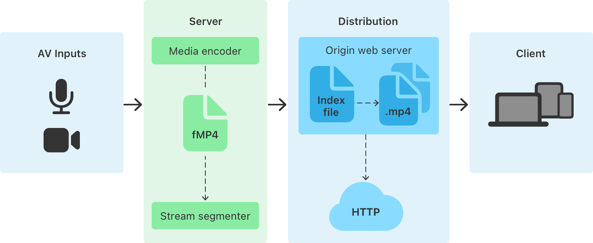
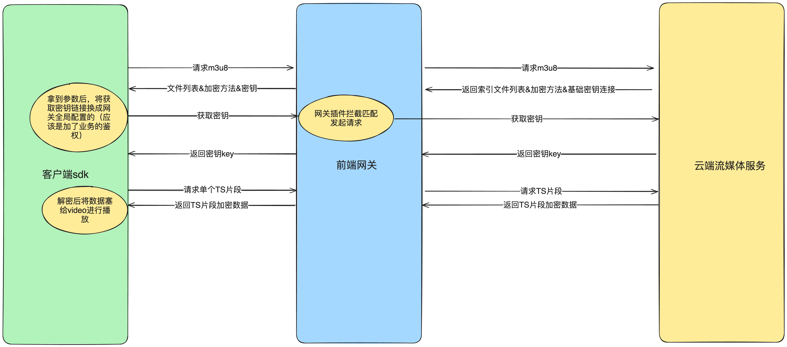

## 概述
> HLS（HTTP Live Streaming）是由Apple公司定义的用于实时流传输的协议，HLS基于HTTP协议实现，传输内容包括两部分。一是M3U8播放列表，二是TS媒体文件（H.265对应的是FMP4格式的文件）。

## 特点
- 基于HTTP协议进行传输，兼容性好
- 单个片段包含完整的音视频数据以及字幕信息等，不存在音视频同步问题
- 自适应流：可根据网络情况和设备性能动态调整视频质量和比特率
- 支持加解密传输
- 支持中间插入广告
- 播放延迟较大

## 适用场景
- 视频直播：HLS是一种流媒体协议，可以实现实时或准实时的视频播放，因此在各种直播平台（如Twitch，YouTube Live等）中都有应用。
- 点播服务：除了直播，HLS也可以用于点播服务，用户可以随时选择观看的内容。
- 在线教育：在线教育平台可以使用HLS提供实时的课程直播，或者录制好的课程视频。
- 网络电视：一些网络电视服务商也使用HLS技术，提供电视节目的在线播放。

## 核心原理
通过将整条流切割成一个小的可以通过HTTP下载的媒体文件（TS片段），然后提供一个配套的媒体列表文件（m3u8）提供给客户端，客户端按照列表顺序去拉取这些媒体文件进行播放，视觉上就是在播放一整段流的效果。由于传输层协议用的标准的HTTP协议，HLS可以方便的透过防火墙或者代理服务器以及利用CDN进行分发加速。



## M3U8索引文件

M3U8文件实质是一个播放列表，其可能是一个媒体播放列表（Media PlayList），或者是一个主列表（Master Playlist）。

- 媒体播放列表：这种类型的M3U8文件包含了一系列的媒体段（通常是TS或fMP4文件）的URL链接，这些媒体段按照在播放列表中的顺序进行播放。对于点播来说，客户端只需要按照顺序下载片段资源，依次播放即可。而对于直播来说，客户端需要定时重新请求该m3u8文件，拉取最新的片段数据。
```
#EXTM3U // 表明该文件是一个 m3u8 文件，必须在文件的第一行
#EXT-X-VERSION:3 //  HLS 的协议版本号
#EXT-X-TARGETDURATION:10 // 该标签指定了媒体文件持续时间的最大值,，播放文件列表中的媒体文件在EXTINF标签中定义的持续时间必须小于或者等于该标签指定的持续时间。该标签在播放列表文件中必须出现一次。
#EXTINF:10,
http://example.com/1.ts
#EXTINF:10,
http://example.com/2.ts
#EXTINF:10,
http://example.com/3.ts
#EXT-X-ENDLIST
```

- 主播放列表：这种类型的M3U8文件并不直接包含媒体内容，而是包含了一系列的媒体播放列表的URL链接。每一个媒体播放列表都代表了同一份媒体内容的不同版本，例如不同的分辨率、不同的码率等。客户端可以根据自身的网络状况和设备性能，从主播放列表中选择最合适的媒体播放列表进行播放。
```
#EXTM3U // 表明该文件是一个 m3u8 文件，必须在文件的第一行
#EXT-X-VERSION:3   //  HLS 的协议版本号
#EXT-X-STREAM-INF:BANDWIDTH=1280000,RESOLUTION=720x480
http://example.com/low.m3u8
#EXT-X-STREAM-INF:BANDWIDTH=2560000,RESOLUTION=1280x720
http://example.com/mid.m3u8
#EXT-X-STREAM-INF:BANDWIDTH=7680000,RESOLUTION=1920x1080
http://example.com/high.m3u8
```

## TS文件

TS（Transport Stream）是一种音视频封装格式，全称MPEG2-TS。MPEG-TS主要应用于实时传送的节目，比如实时广播的电视节目。

TS文件（流）可以分为三层：**TS层（Transport Stream）、PES层（Packet Elemental Stream）、ES层（Elementary Stream）**。

- ES层就是音视频数据
- PES层是在音视频数据上加了时间戳等对数据帧的说明信息
- TS层是在PES层上加入了数据流识别和传输的必要信息。TS文件（码流）由多个TS Packet组成的。


## 加解密

HLS协议支持对媒体内容进行AES-128或SAMPLE-AES加密，以保护媒体内容的安全。
1. 加密流程：
- 服务端首先生成一个随机的AES密钥。
- 使用这个AES密钥对媒体内容进行AES-128或SAMPLE-AES加密，生成加密后的媒体段。
- 将AES密钥加密后存储在服务端，同时生成一个可以用于获取AES密钥的URL链接。
- 在M3U8播放列表中，对于每一个加密的媒体段，都会添加一个EXT-X-KEY标签，该标签包含了获取AES密钥的URL链接和加密方法。

2. 解密流程：
- 客户端在解析M3U8播放列表时，发现EXT-X-KEY标签，就知道媒体段是加密的。
- 客户端通过EXT-X-KEY标签中的URL链接向服务端请求AES密钥。
- 服务端验证客户端的请求后，返回加密的AES密钥。
- 客户端解密AES密钥，然后使用AES密钥对媒体段进行解密，得到原始的媒体内容。
 

## web端如何使用HLS播放云存储视频




```typescript
const HlsVideo: React.FC<IHlsVideoProps> = ({
  debug = false,
  keyPreset = "",
  enableWorker = true,
  url = "",
  hlsRef,
  videoRef,
  videoProps = {},
}) => {
  const defaultVideoProps = React.useMemo(
    () => ({
      disablePictureInPicture: true,
      autoPlay: true,
      controls: false,
    }),
    []
  );
  const _videoProps = { ...defaultVideoProps, ...videoProps };

  React.useEffect(() => {
    const hls = new Hls(config(debug, keyPreset, enableWorker) as any);
    if (hlsRef) {
      hlsRef.current = hls;
    }
    const video = videoRef.current;
    if (hls && video && url) {
      hls.loadSource(url); // 加载m3u8
      hls.attachMedia(video); // 绑定videoElement和hls实例
      return () => hls.detachMedia();
    }
  }, [url]);

  return (
    <video
      style={{ height: "100%", width: "100%" }}
      ref={videoRef}
      {..._videoProps}
    />
  );
};
```

```typescript
// @ts-nocheck
import Hls from "hls.js";

const KEY_URL = "/api/jarvis/hls/key"; // 前端网关配置的用于获取密钥的链接（业务鉴权之类的）
const ORIGIN_KEY_URL = "/api/cloud/key"; // m3u8返回的通用的用于获取密钥的链接

function ab2str(buf) {
  return String.fromCharCode.apply(null, new Uint8Array(buf));
}
function _base64ToArrayBuffer(base64: string) {
  // base64 解码
  const binaryString = window.atob(base64);
  const len = binaryString.length;
  const bytes = new Uint8Array(len);
  for (let i = 0; i < len; i++) {
    bytes[i] = binaryString.charCodeAt(i);
  }

  // 二进制数组
  return bytes.buffer;
}

const configure = (debug: boolean, keyPreset: string, enableWorker: boolean) => ({
  debug,
  enableWorker,
  // defaultAudioCodec: 'mp4a.40.2',
  // enableWorker: false,
  // maxAudioFramesDrift: 23,
  loader: function (config) {
    const loader = new Hls.DefaultConfig.loader(config);

    Object.defineProperties(this, {
      stats: {
        get: () => loader.stats,
      },
      context: {
        get: () => loader.context,
      },
    });

    this.abort = () => loader.abort();
    this.destroy = () => loader.destroy();

    this.load = (context, config, callbacks) => {
      const { type } = context;
      const onSuccess = callbacks.onSuccess;
      callbacks.onSuccess = (response, stats, context1, networkDetails) => {
        if (type !== "manifest" && context1.url.includes("key?devId")) {
          // 针对密钥进行base64解密处理
          const key = keyPreset || JSON.parse(ab2str(response.data)).result.key;
          response.data = _base64ToArrayBuffer(key);
        }
        onSuccess(response, stats, context, networkDetails);
      };
      loader.load(context, config, callbacks);
    };
  },
  xhrSetup: function (xhr: XMLHttpRequest, url: string) {
    // 自定义xhr，替换密钥链接
    const u = url.includes(ORIGIN_KEY_URL)
      ? KEY_URL + "?" + (url as string).split("?")[1]
      : url;
    xhr.open("GET", u, true);
  },
});

export default configure;
```

## HLS直播延迟原因
1. 存在安全缓冲时长，客户端应该从M3U8文件中倒数第三个分片开始播放
2. 服务器更新M3U8文件的间隔，理论上服务器需要大于等于一个EXT-X-TARGETDURATION的时长去更新M3u8文件
3. CDN缓存机制。若当前源站 M3U8 已经更新到了第四个片段，但是CDN边缘节点还缓存着上一个版本的 M3U8文件（只包含3个片段）。此时就需要等文件的TTL过期，边缘节点才会去获取最新版本的 M3U8 文件。而这个缓存TTL也不能取消，如果每个端上的请求到达CDN边缘节点时都去找源站要最新版本，源站就可能会被流量冲垮。
4. 服务器处理时间：服务器接收到媒体源数据后，进行切片编码之后再进行传输。
5. 网络延迟：文件从服务器到客户端中间的网络传输延迟。

## 优化延迟方法

1. 减少客户端安全缓冲时长
2. 减少服务器更新M3U8文件的间隔
3. 减小分片长度
