## 什么是WebRtc？

> WebRTC（Web Real-Time Communication）是一种用于在Web浏览器之间实现实时通信的开放标准和技术集合。它允许浏览器和移动应用程序之间直接进行音频、视频和数据传输，而无需借助第三方插件或扩展。WebRTC 提供了一种使开发者能够轻松构建实时通信功能的方式。

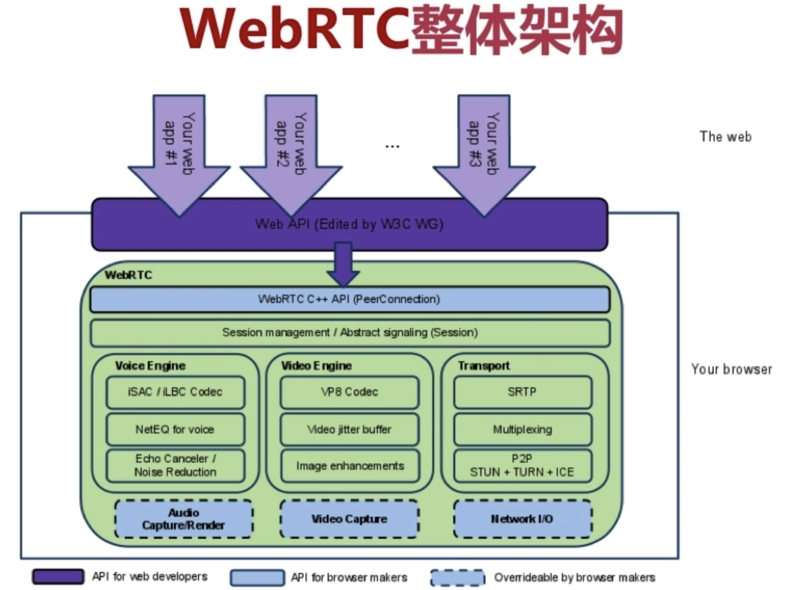

## WebRtc技术关联的浏览器API

### [`getUserMedia`](https://developer.mozilla.org/zh-CN/docs/Web/API/MediaDevices/getUserMedia)
> 这个API允许Web应用程序访问用户的摄像头和麦克风，以便捕获音频和视频数据。（需要注意安全限制：https协议开头的或者是本地localhost这些才能调通）
调用成功后会返回**`MediaStream`**.
**`MediaStream`**：用于表示媒体数据流。流可以是输入或输出，也可以是本地或远程（例如，本地网络摄像头或远程连接，`navigator.mediaDevices.getUserMedia`
）。
必须注意，单个 `MediaStream` 可以包含零个或多个轨道。 每个轨道都有一个对应的 `MediaStreamTrack` 对象，该对象代表用户代理中的特定媒体源。

`MediaStream` 中的所有轨道在渲染时进行同步。

`MediaStreamTrack` 表示包含一个或多个通道的内容，其中，通道之间具有定义的已知的关系。 通道是此 API 规范中考虑的最小单位。 下图显示了由单个视频轨道和两个不同的音频（左声道和右声道）轨道组成的 `MediaStream`。

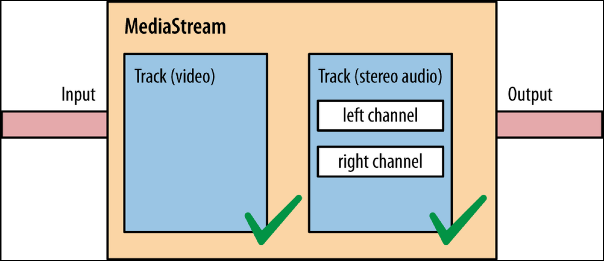

### [`RTCPeerConnection`](https://developer.mozilla.org/zh-CN/docs/Web/API/RTCPeerConnection)

> `RTCPeerConnection` 接口代表一个由本地计算机到远端的 WebRTC 连接。该接口提供了创建，保持，监控，关闭连接的方法的实现。

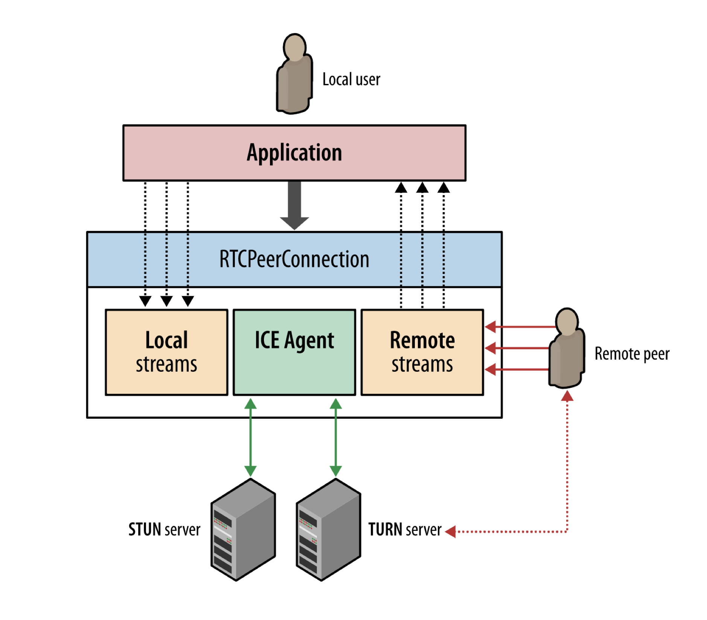

### [`RTCDataChannel`](https://developer.mozilla.org/zh-CN/docs/Web/API/RTCDataChannel)

> `RTCDataChannel` 接口代表在两者之间建立了一个双向数据通道的连接。

因为是浏览器间的直接通信，所以`RTCDataChannel`要比WebSocket快得多。
很多领域都潜在地使用到了这个API，比如：
1. 游戏
2. 远程桌面应用
3. 实时文字聊天
4. 文件传输
5. 分散网络

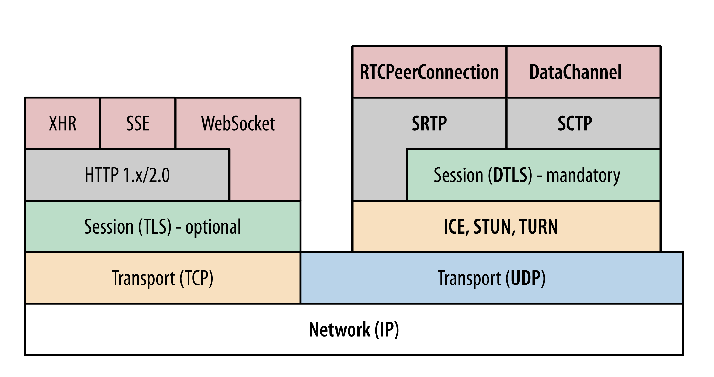

## WebRtc连接过程

要想知道WebRtc的连接过程就需要先知道什么是NAT（Network Address Translation，网络地址转换）。

### NAT（Network Address Translation，网络地址转换）
> NAT是一种网络通信技术，用于将一个网络的 IP 地址（本地局域网）转换成另一个网络（公网）的 IP 地址。其主要目的是解决 IPv4 地址不足的问题。
NAT 技术通过在网络路由器或防火墙上实现地址转换功能，允许多个设备共享一个公共 IP 地址，从而减少了对公共 IP 地址的需求。同时也提高了网络的安全性，因为内部网络的 IP 地址对外部网络是不可见的，从而增加了网络的隐私性和安全性。

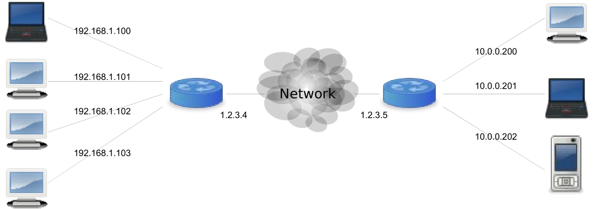

了解了什么是NAT，就知道如果两台设备需要通信，肯定是要能够找到各自对应的ip地址以及对应的端口号（WebRtc也不例外）。这就涉及到了NAT穿透的一些知识。

**常见的网络拓扑图**
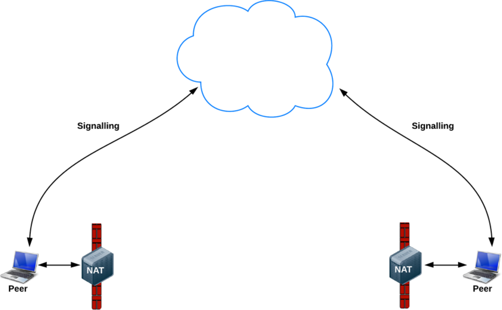

### STUN 协议
> STUN（Session Traversal Utilities for NAT，NAT会话穿越应用程序）是一种网络协议，用于解决网络通信中的NAT穿越问题。
STUN服务器位于公网上，可以帮助客户端发现自己的公网IP地址。客户端通过向STUN服务器发送请求，服务器会返回客户端的公网IP地址和端口号。

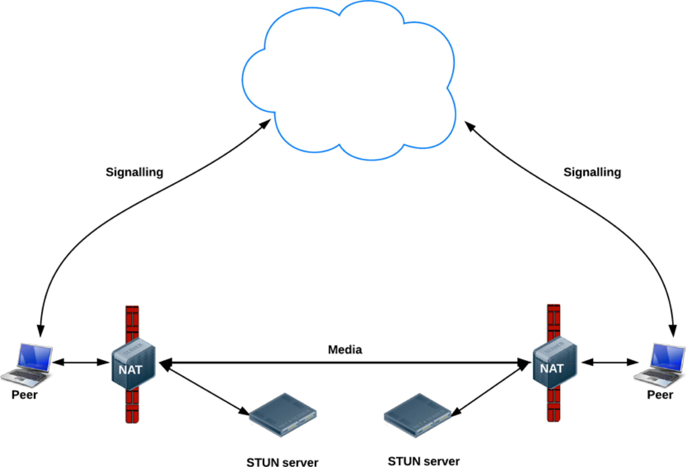

### TURN协议
> 如果STUN无法穿透NAT，可以考虑使用TURN（Traversal Using Relays around NAT）服务器。TURN服务器可以帮助在无法直接连接的情况下，通过中继服务器进行通信。TURN服务器会接收来自客户端的数据，然后转发给对方，从而实现间接通信。

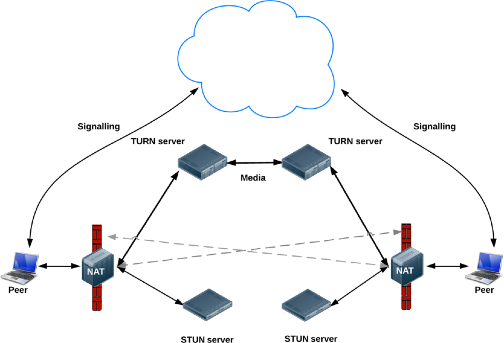

### NAT类型

#### 完全锥型NAT
> 完全锥型 NAT 的特点: 一旦打洞成功，所有知道该洞的主机都可以 通过它与内网主机进行通信。

当host主机通过NAT访问外网主机B时，就会在NAT 上打个洞。如果主机B将该洞的信息分享给主机A和C，那么知道这个洞 的主机A和C都可以通过该洞给内网的host主机发送信息。
这里所谓的“洞”就是在NAT上建立了一个内外网的映射 表。你可以将这个映射表简单地理解为一个4元组，包括内网IP、内网 端口、映射的外网IP以及映射的外网端口。

#### IP限制锥型NAT
> IP 限制锥型 NAT 的特点: 一旦打洞成功，只有与之打洞成功的外网主机才能通过该洞 与内网主机通信，而其他外网主机即使知道洞口也不能与之通信。 

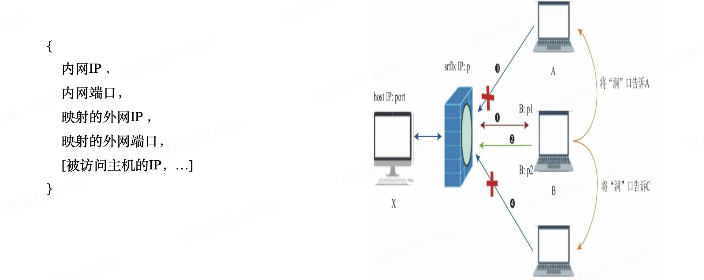

IP限制锥型NAT要比完全锥型NAT严格得多。IP限制锥型NAT的主 要特点:NAT打洞成功后，只有与之打洞成功的外网主机才能通过该洞 与内网主机通信，而其他外网主机即使知道洞口也不能与之通信。
host主机访问主机B时，在NAT上打了一个洞。此 时，只有主机B才能通过该洞向内网host主机发送信息，而其他外网主 机(如A与C)不能再像完全锥型NAT一样通过该洞与内网host主机通信 了。但需要注意的是，主机B上不同的端口(如p1、p2等)是可以向 host主机发送消息的。

#### 端口限制NAT
> 端口限制锥型 NAT 的特点: 一旦打洞成功，除了像IP限制锥型 NAT 一样需要对IP地址进行检测外，还需要对端口进行检测 。

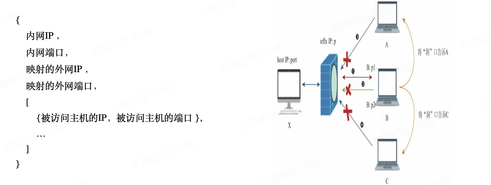

host主机访问主机B时在NAT上打了一个洞，此时外 网主机A和C是访问不了内网host主机的，这与IP限制锥型NAT是一样 的。此外，如果host主机访问的是主机B的p1端口，那么只有主机B的p1 端口发送的消息才能穿越NAT，而主机B的p2端口已无法再通过NAT 了。

#### 对称型NAT
> 对称型 NAT 的特点: 内网主机每次访问不同的IP或端口时，都会生成一个新洞，而不像前面3种NAT类型使用的是同一个洞。 

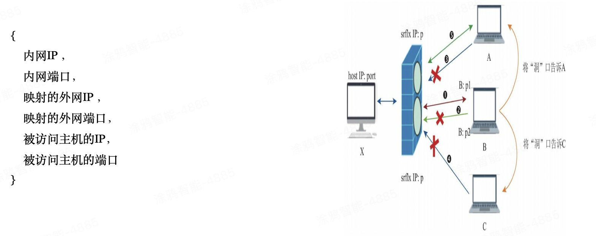

在对称型NAT中，host主机访问主机B时在NAT上打 了一个洞，此时只有主机B上相应端口发送的数据才能穿越该洞，这一 点与端口限制型NAT是一致的。它与端口限制型NAT最大的不同是当 host主机访问外网主机A时，它与主机A之间会新建一个洞，而不是复用 访问主机B时的洞。

#### 打洞举例
**A B均为完全锥型NAT**

1. A 向 server 发起与 B 的打洞请求，server 向 B 转发打洞请求，同时A向 PB1 直接发送探测包，那么 A 为 B 在 PA1 已经成功打洞，但是 A 的消息无法到达，因为 B 的 NAT 会将不明的地址(PA1) 丢弃/拒绝。
2. B 收到从 server 转发过来的打洞请求后，向 PA1 直接发送探测包，这时 B 的 NAT 可以放行 PA1 的消息了，也就是 B 为 A 在 PB1 上完成了打洞。
3. 至此，A 和 B 消息能够互通，打洞成功

**A为对称型 B为端口限制型**

由于 B 收到 server 转发过来的打洞请求后，是向 PA1 发送探测包的，因为 B 只知道 PA1（PA1 是 A 与 server 连接是映射的端口号，server 也只知道 PA1)，但是 A 由于是对称型 NAT，所以会拒绝B往PA1发的消息，同时会从一个新端口 PA2 向 B 发包，但是 B 由于是端口限制型，只允许 PA1 端口的包通过，所以 B 会拒绝 PA2。

**A为对称型 B为IP限制型**

#### 各NAT类型打洞可行性
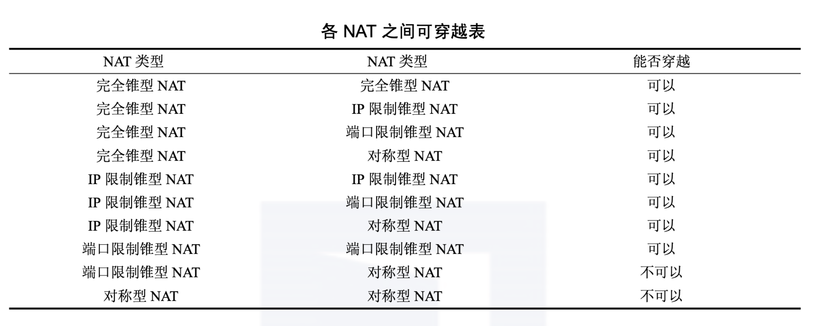

### ICE
> ICE（Interactive Connectivity Establishment）候选项（ICE candidates）是一组网络地址（包括IP地址和端口号），用于建立对等连接（peer-to-peer connections）的过程中。ICE候选项由WebRTC框架自动收集和处理，用于解决网络中存在的NAT（Network Address Translation）和防火墙问题，以便在不同的网络环境中实现点对点通信。

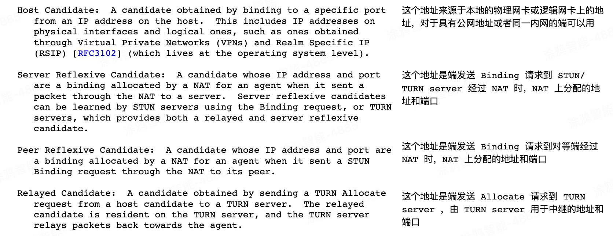

WebRtc将Candidate分为四种类型：host、srflx、prflx及 relay，且它们还有优先级次序，其中host优先级最高，relay优先级最低。比如WebRTC收集到了两个Candidate，一个是host类型，另一个是 srflx类型，那么WebRTC一定会先尝试与host类型的Candidate建立连 接，如果不成功，才会使用srflx类型的Candidate。 

#### ICE候选交换过程
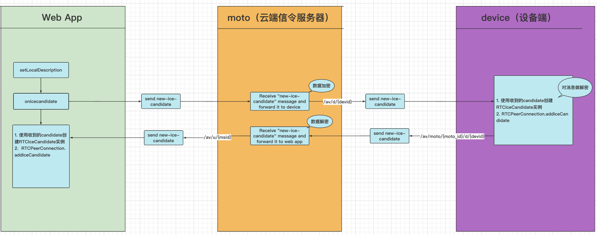

### 信令交互过程（sdp 主要用来协商媒体格式）
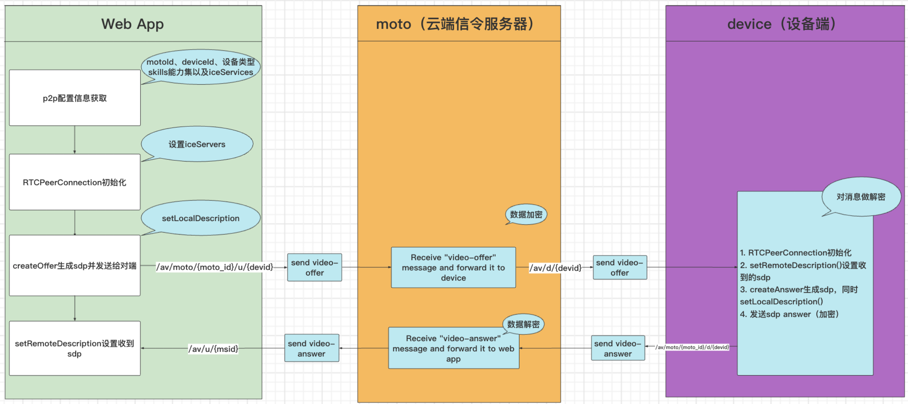

### WebRtc连接核心过程
1. 创建 p2p 通道端 A，添加本地视频流至通道，并且本地预览
2. 创建 p2p 通道端 B，添加本地视频流至通道，并且本地预览
3. offer、answer 交换
4. addIceCandidate 候选地址
5. 通道 A、B 连接建立成功，获取对端视频流，播放