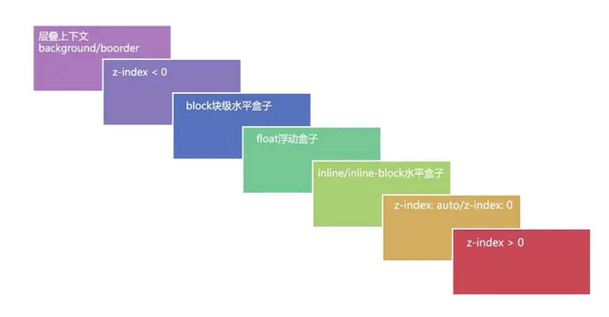

##### **css层叠上下文、层叠等级、层叠顺序以及z-index**

- **层叠上下文**

  > 层叠上下文是HTML中的一个三维概念。分为x轴、y轴、z轴，层叠上下文就是对这些HTML元素的三维构想。
  >
  > 满足一下任意一个条件及可形成层叠上下文：
  >
  > - 文档的根元素`<html>`
  > - position值不为static（z-index值不为auto的元素）
  > - flex容器的子元素（z-index值不为auto的元素）
  > - grid容器的子元素（z-index值不为auto的元素）
  > - opacity值小于1的元素
  > - mix-blend-mode值不为normal的元素
  > - css3属性（值不为none）
  >   - transform
  >   - filter
  >   - perspective
  >   - clip-path
  >   - mask/mask-image/mask-border
  > - isolation属性值为isolate的元素
  > - -webkit-overflow-scrolling属性值为touch的元素
  > - will-change
  > - contain值为layout、paint或包含它们其中之一的合成值

- **层叠等级**

  > 层叠等级：
  >
  > - 在同一个层叠上下文中，它描述定义的是该层叠上下文中的层叠上下文元素在Z轴上的上下顺序。
  > - 在其他普通元素中，它描述的是这些普通元素在Z轴上的上下顺序。
  > - 层叠等级的比较只有在当前层叠上下文中才有意义。不同层叠上下文的层叠等级比较是没有意义的。

- **层叠顺序**

  > 层叠顺序：表示元素发生层叠时按照特定的元素规则在Z轴上垂直显示。（层叠上下文和层叠等级是一种概念，而层叠顺序是一种规则）
  >
  > 

- **比较流程**

  > 1. 首先看比较的两个元素是否处在一个层叠上下文中
  >
  >    - 如果是，则谁的层叠等级大(层叠等级通过层叠顺序图来判断)，则谁在上边。
  >
  >    - 如果不是，则比较它们所处的层叠上下文的层叠等级
  >
  > 2. 当两个元素层叠等级相同、层叠顺序相同时，在dom结构中，后面的元素的层叠等级在前面的元素之上。
  >
  > 