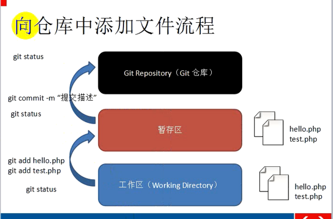

### git使用

##### 安装完成后

打开命令行窗口或（终端）

**设置用户名**

```shell
git config --global user.name 'username'
```

**设置用户邮箱**

```shell
git config --global user.email 'user@163.com'
```

**查看设置**

```shell
git config --list
```

*注意：`git config --global`参数设置后，表明这台机器上的所有Git仓库都会使用这个配置，当然也可以指定某个仓库设置不同的用户名邮箱*

##### 创建仓库（repository）

什么是仓库：你可以将其理解为一个简单的目录，这个目录里面的所有文件都可以被Git管理起来，每个文件的修改、删除、Git都能跟踪，以便任何时刻都可以追踪历史，或者在将来某个时刻可以还原。

```shell
mkdir newRep
cd newRep
```

**创建完仓库后**

```shell
git init //将这个目录变成Git可以管理的仓库
```

**将需要上传的文件放到当前文件夹下**

1. 工作区：就是当前的文件目录，在工作去有一个隐藏目录`.git`，这个不算工作区，而是Git的版本库。

   git的版本库

2. 暂存区

3. 仓库



**将文件添加到暂存区**

```shell
git add filename1.txt
git add filename2.txt filename3.txt
```

**将文件提交到仓库**

```shell
git commit -m '描述信息'
```

*多次使用`add`添加多个文件，`commit`可以一次提交多个文件*

**查看仓库当前状态**

```shell
git status	//可以查看需要上传的文件是否修改了
git diff filename.txt  //查看修改后的文件与之前的文件的不同之处
```

*修改后的文件上传的话，需要重新进行`add`和`commit`*

##### 版本回退

**查看提交历史**

```shell
git log
```

*在git中，用`HEAD`表示当前版本，上一个版本就是	`HEAD^`，上上个版本就是`HEAD^^`，当然往上100个版本不可能写100个^，可以写成`HEAD~100`*

**回到上个版本中**

```shell
git reset --hard HEAD^	//使用git reset命令可以回退版本
```

*`HEAD`也可以是通过`git log`命令查看到的每次提交的id，这样就可以在不同的版本之间来回的切换了。*

```shell
git reflog //用来记录你的每一次命令
```

##### 撤销修改

```shell
git checkout -- readme.txt
```

意思就是，把`readme.txt`文件在工作区的修改全部撤销，这里有两种情况：

一种是`readme.txt`自修改后还没有被放到暂存区，现在，撤销修改就回到和版本库一模一样的状态；

一种是`readme.txt`已经添加到暂存区后，又作了修改，现在，撤销修改就回到添加到暂存区后的状态。

总之，就是让这个文件回到最近一次`git commit`或`git add`时的状态。

`git checkout`其实是用版本库里的版本替换工作区的版本，无论工作区是修改还是删除，都可以“一键还原”。

##### 删除文件

```shell
git rm filename.txt 
```

##### 远程仓库

**首先创建SSH Key。**

在用户主目录下，看看有没有.ssh目录，如果有，再看看这个目录下有没有`id_rsa`和`id_rsa.pub`这两个文件，如果已经有了，可直接跳到下一步。如果没有，打开Shell（Windows下打开Git Bash），创建SSH Key：

```shell
ssh-keygen -t rsa -C "youremail@example.com"
```

你需要把邮件地址换成你自己的邮件地址，然后一路回车，使用默认值即可，由于这个Key也不是用于军事目的，所以也无需设置密码。

如果一切顺利的话，可以在用户主目录里找到`.ssh`目录，里面有`id_rsa`和`id_rsa.pub`两个文件，这两个就是SSH Key的秘钥对，`id_rsa`是私钥，不能泄露出去，`id_rsa.pub`是公钥，可以放心地告诉任何人。

第2步：登陆GitHub，打开“Account settings”，“SSH Keys”页面：

然后，点“Add SSH Key”，填上任意Title，在Key文本框里粘贴`id_rsa.pub`文件的内容

##### 将本地仓库内容推送到GitHub仓库中

```shell
git remote add origin git@github.com:yymfp/blog.git  //关联远程库  yymfp改成自己的GitHub用户名
git push -u origin master
```

*由于远程库是空的，我们第一次推送`master`分支时，加上了`-u`参数，Git不但会把本地的`master`分支内容推送的远程新的`master`分支，还会把本地的`master`分支和远程的`master`分支关联起来，在以后的推送或者拉取时就可以简化命令。*

要关联一个远程库，使用命令`git remote add origin git@server-name:path/repo-name.git`；

关联后，使用命令`git push -u origin master`第一次推送master分支的所有内容；

此后，每次本地提交后，只要有必要，就可以使用命令`git push origin master`推送最新修改；

分布式版本系统的最大好处之一是在本地工作完全不需要考虑远程库的存在，也就是有没有联网都可以正常工作，而SVN在没有联网的时候是拒绝干活的！当有网络的时候，再把本地提交推送一下就完成了同步，真是太方便了！

##### 从远程库克隆

```shell
git clone git@github.com:yymfp/仓库名.git
```

*GitHub给出的地址不止一个，还可以用`https://github.com/michaelliao/gitskills.git`这样的地址。实际上，Git支持多种协议，默认的`git://`使用ssh，但也可以使用`https`等其他协议。*

*使用`https`除了速度慢以外，还有个最大的麻烦是每次推送都必须输入口令，但是在某些只开放http端口的公司内部就无法使用`ssh`协议而只能用`https`。*

##### 创建与合并分支

创建新的分支：

```shell
git checkout -b dev 
Switched to a new branch 'dev'
```

`git checkout`命令加上`-b`表示创建并切换，相当于以下两条命令：

```shell
git branch dev
git checkout dev
Switched to branch 'dev'
```

然后`git branch`查看当前分支