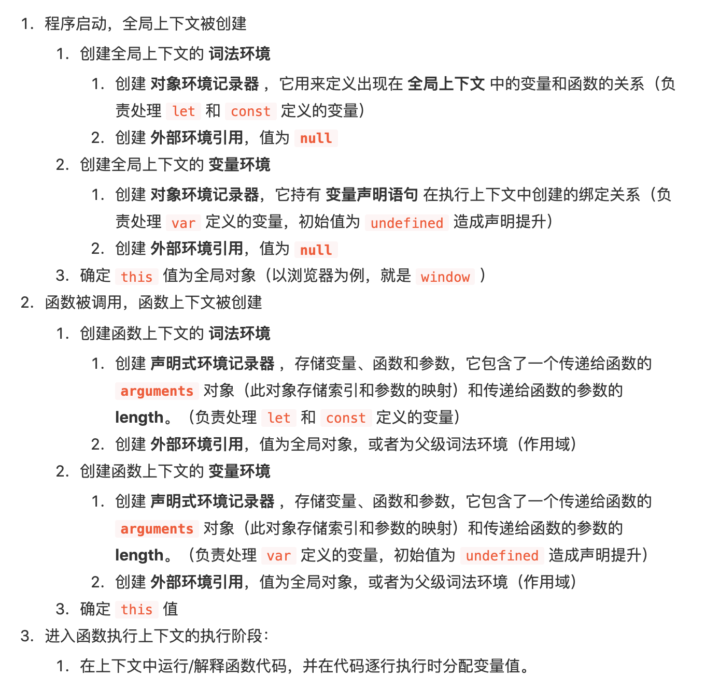
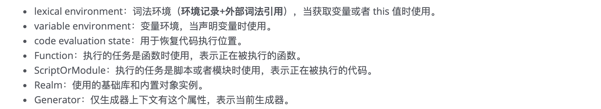

### js变量提升---预处理

js引擎在代码正式执行前会做一个预处理工作：

1. 收集变量

2. 收集函数

   依据：

   * var 将var后边的变量定义但不赋值 `var username = undefined`
   * function(){} 提前定义该函数

   ​	

### 执行上下文

- 理解：代码执行的环境

- 时机：代码正式执行之前会进入到执行环境

- 创建执行上下文（**es3版本**）：

  1. 创建变量对象：

     - 变量
  
     - 函数及函数的参数
  
     > 函数声明会被加入到变量对象中，而函数表达式会被忽略
       >
     > ```js
       > function fn(){} // 函数声明
       > var fn = function _fn(){} //函数表达式   fn会作为变量加入到变量对象中  _fn作为函数表达式，不会被加入到变量对象中
     > ```
  
   - 全局：window
  
   - 局部：抽象的但是确实存在
  
     > 函数内部的变量，只会在函数执行的过程中存在，在函数被调用时，具体的代码执行之前，js引擎会用当前函数的参数列表（`arguments`）初始化一个“变量对象”并将当前执行上下文与之关联，函数内部代码声明的**变量**和**函数**将作为属性加到这个变量对象中。
  
  2. 确认this的指向
  
     - 全局：this ---> window
     - 局部： this ---> 调用其的对象
  
  3. 创建作用域链

     - 构成：父级作用域链+当前的变量对象
  
     - 查找规则：查找变量时，会先从当前执行上下文变量对象中查找，如果没找到，就会从父级（词法层面）执行上下文的变量对象中查找，一直找到最外层（全局上下文）的变量对象。
  
       > 函数的作用域在函数创建时就确定了。当函数创建时，会有一个名为[[scope]]的内部属性保存所有父级变量对象到其中。当函数调用时，会创建函数执行环境，将[[scope]]属性复制初始化作用域链，变量对象（VO）激活为活动对象（AO），并添加到作用域链前端，完成创建作用域链：
       >
       > ```js
       > Scope = [AO].concat([[Scope]]);
       > ```
  
  4. 扩展：
  
     ```js
     ECObj = {
         //变量对象： {变量，函数，函数的形参},
         //scopeChain：父级作用域链+当前的变量对象,
         //this:{window || 调用其的对象}
     }
     ```
  
- 创建执行上下文（es5）

  [可参考](https://juejin.im/post/5ba32171f265da0ab719a6d7#heading-5)

- 创建执行上下文（es6）

  