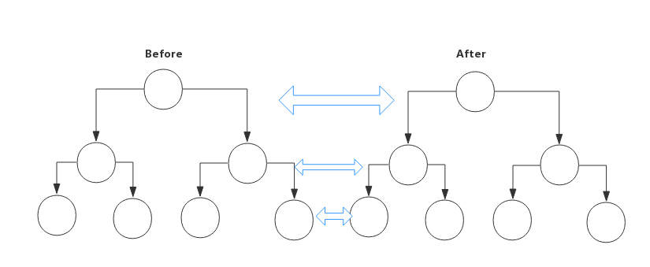
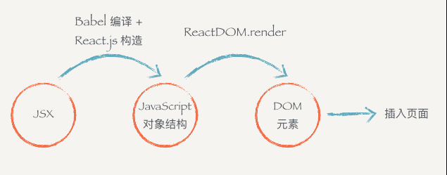
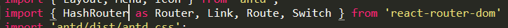

### React

##### React中的几个核心概念

1. **虚拟DOM**

   - **DOM本质是什么**：是浏览器中的概念，用JS对象来表示页面上的元素，并提供了操作DOM对象的API。

   - **什么是React中的虚拟DOM**：是框架中的概念，是程序员用JS对象来模拟页面上的DOM和DOM嵌套。

   - **使用虚拟DOM的目的**：为了实现页面中，DOM元素的高效更新。

   - **DOM和虚拟DOM之间的区别**：

     - **DOM**：浏览器中提供的概念，用JS对象表示页面上的元素，并提供操作元素地API。

     - **虚拟DOM**：是框架中的概念，开发框架的程序员手动用JS对象来模拟DOM元素和嵌套关系。

       ```html
       <div class="Odiv" data-index="0">
           div文本
           <p>
               p文本
           </p>
       </div>
       <script>
           //使用js对象模拟DOM树
           var div={
               tagName:'div',
               attr:{
                   class:'Odiv',
                   'data-index':'0'
               },
               childrens:[
                   'div文本',
                   {
                       tagName:'p',
                       attr:{},
                       childrens:[
                           'p文本'
                       ]
                   }
               ]
           }
       </script>
       ```

2. **Diff算法**

   - **tree diff**：新旧两颗DOM树逐层对比的过程，就是Tree Diff，当整颗DOM逐层对比完毕，则所有需要被按需更新的元素，必然能够被找到。

   - **component diff**：在进行Tree diff的时候，每一层中，组件级别的对比，叫做Component diff。

     1. 如果对比前后，组件的类型相同，则暂时认为此组件不需要被更新。
     2. 如果对比前后，组件类型不同，则需要移除旧的组件，创建新组件，并追加到页面上。

   - **element diff**：进行组件对比的时候，如果两个组件类型相同，则需要进行元素级别的对比，这就叫做Element diff。

     

##### 在项目中使用react

1. 运行`npm i react react-dom -S`安装包
   - react：专门用于创建组件和虚拟DOM的，同时组件的生命周期都在这个包中
   - react-dom：专门进行DOM操作的，最主要的应用场景，就是`ReactDOM.render()`

2. 在`index.html`页面中，创建容器：

   ```html
   <!-- 容器，在使用react创建的虚拟DOM元素，都会被渲染到这个指定的容器中 -->
   <div id="app">
       
   </div>
   ```

3. 在`index.js`中导入包：

4. ```js
   //1. 这两个包导入的时候，必需这么写
   import React from 'react'  //创建组件、虚拟DOM元素、生命周期
   import ReactDOM from 'react-dom'  //把创建好的组件和虚拟DOM放到页面上展示
   
   //2. 创建虚拟DOM元素
   //参数1：创建的元素的类型，字符串，表示元素的名称
   //参数2：是一个对象或null，表示当前这个DOM元素的属性
   //参数3：子节点（包括其他虚拟DOM获取文本子节点）
   //参数n：其他子节点
   //<h1>这是一个h1标签</h1>
   const myH1=React.createElement('h1',null,'这是一个h1标签')
   
   //3. 使用ReactDOM把虚拟DOM渲染到页面上
   //参数1：要渲染的那个虚拟DOM元素
   //参数2：指定页面上一个容器
   ReactDOM.render(myH1,document.getElementById("app"))
   ```

   使用`babel`转换JS中的标签：

   > 什么是JSX语法：就是符合xml规范的JS语法。（语法格式相对HTML严谨很多）

   **注意：在JS中，混合写入类似于HTML的语法，叫做JSX语法。（默认无法识别，会报错，需要第三方转换插件）**

   **注意：JSX语法的本质，还是在运行的时候，被转换成了React.createElement形式来执行。**

   1. 如何启用jsx语法：

      - 安装`babel`插件

        - 运行`npm i babel-core babel-loader babel-plugin-transform-runtime -D`

        - 运行`npm i babel-preset-env babel-preset-stage-0 -D`

      - 安装能够识别转换JSX语法的包`babel-preset-react`

        - 运行`npm i babel-preset-react -D`

          ```js
          //配置webpack.config.js文件
          const path = require('path')
          const HtmlWebPackPlugin = require('html-webpack-plugin') //导入 在内存中自动生成index页面的插件
          
          //创建一个插件实例对象
          const htmlPlugin = new HtmlWebPackPlugin({
              template: path.join(__dirname, './src/index.html'), //源文件
              filename: 'index.html' //生成的内存中首页名称
          })
          
          //向外暴露一个打包的配置对象， 因为webpack是基于Node构建的，所以webpack支持所有的Node API和语法
          module.exports={
              mode:'production', //development production
              //在webpack 4.x中，有一个很大的特性，就是约定大于配置，默认的打包入口路径是src -> index.js
              plugins:[
                  htmlPlugin
              ],
              module:{ //所有第三放模块的配置规则
                  rules:[ //第三方匹配规则
                      { test: /\.js|jsx$/,use: 'babel-loader',exclude: /node_modules/ }, //test匹配规则 use 使用插件 exclude 排除项
                      //可以在 css-loader之后，通过? 追加参数
                      //其中由两个固定的参数，叫做modules，表示为普通的css样式表，启用模块化
                      //注意:css模块化只针对类选择器和ID选择器生效 不会将标签选择器模块化
                      { test: /\.css$/, use: ['style-loader','css-loader?modules&localIdentName=[path][name]-[local]-[hash:5]']}, //打包处理css样式表的第三方loader
                      {test: /\.ttf|woff|woff2|eot|svg$/, use: 'url-loader'}, //打包处理 字体文件的loader
                  ]
              },
              resolve:{
                  extensions:['.js','jsx','.json'], //表示，这几个文件的后缀名可以省略不写
                  alias:{
                      '@': path.join(__dirname, './src') //这样，@表示项目根目录中src的这一层路径
                  }
              }
          }
          ```


##### 配置`babel`配置文件

在项目的根目录中创建文件后缀为`.babelrc`的文件

```json
{
 	"presets":["env","stage-0","react"],
    "plugins":["transform-runtime"]
}
```

在`index.js`文件中使用JSX语法：

```js
// 这两个包导入的时候，必需这么写
import React from 'react'  //创建组件、虚拟DOM元素、生命周期
import ReactDOM from 'react-dom'  //把创建好的组件和虚拟DOM放到页面上展示

let a=10;
let str="你好！";
let boo=true;
let title="titleName";
const h1=<h1>这是一个H1</h1>;
const arr=[
    <h2>这是h2</h2>
    <h3>这是h3</h3>
];
const arrstr=['张三','李四','王五'];

// 使用ReactDOM把虚拟DOM渲染到页面上
//参数1：要渲染的那个虚拟DOM元素
//参数2：指定页面上一个容器
ReactDOM.render(<div>
                {a+2} //12
                {str} //你好
                {boo ? '条件为真' : '条件为假'} //条件为真
                <p title={title}>P标签</p>
                {h1}
                {arr}
                {arrstr.map(item => <h5>{item}</h5>)}
                </div>,document.getElementById("app"))
```

##### 创建组件的方式

1. 第一种：

   ```js
   //导入包
   import React from 'react'
   import ReactDOM from 'react-dom'
   
   //第一种创建组件的方式 (是一个构造函数，首字母大写)
   function Hello(props){
       return <div>这是Hello组件 --{props.name}--{props.gender}</div>
   }
   //定义参数变量
   const dog={
       name:'阿旺',
       gender:'雄'
   }
   //调用render函数渲染 jsx xml 比HTML严格的多
   ReactDOM.render(<div>
                   <Hello name={dog.name} gender={dog.gender}></Hello>
                   </div>,document.getElementById('app'))
   ```

2. 第二种：

   ```js
   //如果要使用class定义组件，必需让自己的组件，继承自React.Component
   class '组件名称' extends React.Component{
       //构造器
       constructor(){
           //子类的自定义构造器中必需先调用super()
           super();
           //只有调用了super才能使用this关键字
           this.state={ //相当于vue中的data(){ return{} }
               msg:'hello',
           }
       }
       //在组件内部，必须有render函数 作用：渲染当前组件对应的虚拟DOM结构
       render(){ //render函数中必需返回合法的jsx虚拟dom结构
           //在class关键字中创建的组件，如果要访问外界传递的参数，不需接收，直接this.props.***就可以访问
           return <div>
               这是一个div 
           <h3>{this.state.msg}</h3>
           </div>;
       }
   }
   ```

   **两种创建组件方式的区别：**

   > 注意：使用`class`创建的组件，有自己的私有数据和生命周期函数；
   >
   > 使用`function`创建的组件，只有props，没有自己的私有数据和生命周期；
   >
   > 1. 用**构造函数**创建出来的组件：叫做“无状态组件”
   > 2. 用**class关键字**创建出来的组件：叫做“有状态组件”
   > 3. 有状态组件和无状态组件的本指区别就是：有无state属性

   组件中的`props`和`state/data`之间的区别：

   - `porps`中的数据都是外界传递过来的；
   - `state/data`中的数据，都是组件的私有数据（通过Ajax传递过来的）；
   - `props`中的数据都是只读的，不能被重新赋值；
   - `state/data`中的数据，都是可读可写的；
   - `state`是让组件控制自己的状态的，`props`是让外部对组件进行自我配置的。

##### 组件的props

​	在使用一个组件的时候，可以把参数放在标签的属性当中，所用属性都会作为`props`对象的键值。甚至可以传入一个函数作为属性的参数。

```jsx
class Index extends Component {
  render () {
    return (
      <div>
        <LikeButton
          wordings={{likedText: '已赞', unlikedText: '赞'}}
          onClick={() => console.log('Click on like button!')}/>
      </div>
    )
  }
}
```

可以通过`this.props.onClick`获取到这个传进去的函数。

1. 默认配置defaultProps

   ```jsx
   class Link extends Component{
       static defaultProps={
           liked:'喜欢',
           unlike:'不喜欢'
       }
       constructor(){
           super();
           this.state={
               
           }
       }
       render(){
           return <div></div>
       }
   }
   ```

2. props不可变

   > `props`一旦传入进来就不能改变。如果想要去改变，只能是从父组件重新传入新的内容进行重新渲染的方式去改变。

##### 组件抽离为JSX文件

**注意：所谓jsx其实就是js对象**

```jsx
// components/Hello.jsx
//需要导入React
import React from 'react'
export default function Hello(props){	//定义组件并导出
    return <div>这是一个Hello组件 --{props.name}--{props.gender}</div>
}
```

```js
//导入包
import React from 'react'
import ReactDOM from 'react-dom'

//导入组件
//默认，如果不做单独的配置的话，不能省略.jsx后缀名
import Hello from './components/Hello.jsx'

//定义参数变量
const dog={
    name:'阿旺',
    gender:'雄'
}
//调用render函数渲染 jsx xml 比HTML严格的多
ReactDOM.render(<div>
                <Hello name={dog.name} gender={dog.gender}></Hello>
                </div>,document.getElementById('app'))
```

**jsx到页面到底经过了怎样的过程呢？**



为什么不直接从jsx直接渲染构造DOM结构呢？

1. 第一个原因是：当我们拿到一个表示ui的结构和信息的对象以后，不一定会把元素渲染到浏览器的普通页面上，我们有可能会将它们渲染到canvas或者是手机app上。而js对象可以很方便让我们去进行其他地方的渲染。（ReactNative就是帮我们把它转换成原生的app的）
2. 第二个原因是：有了这一个对象，当数据变化，需要更新组件的时候，就可以用比较块的算法操作这个js对象，而不用直接去操作页面中的dom元素，这样可以尽可能的减少浏览器的重排，优化性能。
3. 总结：
   - jsx是js语言的一种语法扩展，长得像html，但并不是html。
   - React.js可以用jsx来描述你的组件长什么样。
   - jsx在编译的时候会变成相应的js对象描述。
   - react-dom负责把这个用来描述UI信息的js对象转变成dom元素并且渲染到页面中去。

**渲染列表**

对于用表达式套数组罗列到页面上的元素，都要为每个元素加上key属性，这个key必需是每个元素唯一的标识，一般来说，`key`的取值为后台传过来的`id`值。

##### 在组件中使用style

```js
class '组件名称' extends React.Component{
    constructor(){
        super();
        this.state={ 
            msg:'hello',
        }
    }
    //注意 在jsx语法中不能识别行内样式，不能为style设置字符串的值。
    //正确的写法： style={ {color:'red'} }
    render(){ 
        return <div style={ {color:'red' fontSize:'20px'} }>
            这是一个div 
        <h3>{this.state.msg}</h3>
        </div>;
    }
}
```

使用`localIdentName`自定义生成的类名格式，可选的参数有：

- `[path]`表示样式表相对于**项目根目录**所在的路径

- `[name]`表示样式表文件名称

- `[local]`表示样式的类名定义名称

- `[hash:length]`表示32位的hash值

  例子：`{ test: /\.css$/, use: ['style-loader','css-loader?modules&localIdentName=[path][name]-[local]-[hash:5]']}`

使用`:local()`和`:global()`

- `:local()`包裹的类名，是被模块化选中的。（默认）`className={cssObj.类名}`
- `:global()`包裹的类名，是全局生效的，不会被模块化（`css-modules`）控制，定义的类名是什么，就使用定义的类名`className="类名"`

##### 在项目中使用模块化并同时使用bootstrap

1. 把自己的样式表，定义为`.scss`文件

2. 第三方的样式表还是以`.css`结尾

3. 只为自己定义的`.scss`文件启用模块化即可

4. 运行`npm i sass-loader node-sass -D` 安装能够解析`scss`文件的loader

   例子：`{test: /\.scss$/, use: ['style-loader','css-loader','sass-loader']}` 打包处理`.scss`文件的`loader`

##### React中绑定事件的注意点

1. 事件的名称都是React提供的，首字母大写`onClick`、`onMouseOver`，需要注意的是，这些事件监听只能用在普通的HTML标签上，而不能用在组件的标签上。

   ```jsx
   <Header onClick={...} />
   ```

   这样的写法是不对的，不会有什么效果。

2. 为事件提供的处理函数，必须是如下格式

3. ```js
   onClick={function}
   ```

   用的最多的事件绑定形式为：

   ```jsx
   <button onClick={ () => this.show('参数') }>按钮</button>
   
   //事件的处理函数，需要定义为一个箭头函数，然后赋值给函数名称
   show = (arg1) => {
       console.log('show方法'+arg1);
   }
   ```

4. 再React中，如果想要修改state中的数据，推荐使用`this.setState({ })`，此方法是**异步的**。

用法:

```js
this.setState({
	msg:''
},function(){	//回调函数，若想得到最新的state值，需要再回调函数内部获取
    
})
```

5. 实现文本框数据双向更新

   ```jsx
   <input value={this.state.msg} onChange={(e)=>this.changeTxt(e)} ref="txt"></input>
   
   textChange= (e) =>{
       const newText=this.refs.txt.value; //或者等于e.target.value
       this.setState({
           msg: newText
       })
   }
   ```

6. event对象

   和普通的浏览器一样，事件监听函数会被自动传入一个`event`对象，这个对象和普通的浏览器`event`对象所包含的方法和属性都基本一致。不过，`react.js`中的`event`是经过封装的，对外提供了统一的api，这样就不用考虑浏览器的兼容性问题。这个`event`对象符合`w3c`标准。它具有类似`event.stopPropagation`、`event.preventDefault`这种常用的方法。

7. this问题

   在`react`调用你所传入给它的方法的时候，并不是通过对象方法的方式去调用的，而是直接通过函数调用的，所以事件监听函数内并不能通过this获取到实例。

   如果你想获取到当前的实例，需要手动将this bind进去。

   ```jsx
   class Title extends Component {
     handleClickOnTitle (e) {
       console.log(this)
     }
   
     render () {
       return (
         <h1 onClick={this.handleClickOnTitle.bind(this)}>React 小书</h1>
       )
     }
   }
   ```


##### React组件的生命周期分为三部分：

> 这里只是列举了常用的生命周期，不包括所有的，如需了解其他的，请参考官方文档。

*在了解生命周期之前，先介绍什么是挂载：*

**组件的挂载：React.js将组件渲染，并且构造DOM元素然后塞入页面的过程称为组件的挂载。**

**React.js会在组件的`render`之前调用`componentWillMount`，在DOM元素塞入页面以后调用`componentDidMount`**

**一般来说，所有关于组件自身的状态的初始化工作都会放在`constructor`里面（比如React.js组件中的状态state就是在这个阶段初始化）**

****

- **组件的创建阶段**：特点，只会执行一次

  > componentWillMount:（**常用来做一些组件启动的动作，包括像Ajax数据的拉取操作、一些定时器的启动等，就可以放在这个阶段去进行**）
  >
  > ```js
  > //写一个Ajax
  > componentWillMount(){
  >     ajax.get('http://json-api.com/user',(userData)=>{
  >         this.setState({userData})
  >     })
  > }
  > ```
  >
  > render:（**react.js最重要的步骤，用来创建虚拟dom，进行Diff算法，更新dom树都在此进行，此时不能更改state**）
  >
  > **render之后会将虚拟dom渲染并插入到页面的根节点中**
  >
  > componentDidMount:（**此阶段组件已经渲染完毕，可以获取dom结点**）

- **组件的运行阶段**：按需，根据props属性或state状态的改变，有选择性的执行0到多次

  > componentWillReceiveProps:（**组件在接收新的props时调用，组件初始化时不调用**）
  >
  > shouldComponentUpdateL:（**react性能优化非常重要的一环。组件接受新的state或者props时调用，我们可以设置在次对比前后两个props以及state是否相同，如果相同则返回false阻止更新，因为相同的属性状态一定会生成相同的dom树，这样就可以避免创造新的dom树和旧的dom树进行diff算法对比，节省大量性能，特别是在dom结构相对复杂的时候**）
  >
  > componentWillUpdate:（**组件初始化时不调用，组建更新调用**）
  >
  > render:（**组件再次渲染**）
  >
  > componentDidUpdate:（**此阶段类似`componentDidMount`，此时可以获取dom结点**）

- **组件的销毁阶段**：只执行一次

  > componentWillUnmount:（**它的作用主要是用来销毁一些数据事件监听以及定时器的**）

##### React路由

1. React-router

   React-router提供了`Router`,`Route`,`Switch`等`router`的核心api，但是它没有提供dom操作进行相关跳转的api。

2. React-router-dom

   React-router-dom提供了`BrowserRouter`,`Route`,`Link`等api，可以通过它们来操作dom的事件从而控制路由。

   用法：(以下两个是路由的基本，就像盖房子一样，要有地基，需要将它们包裹在最外层，作为路由的根节点，我们只需要选择它们其一就可以了)

   1. HashRouter

      > **特点：**它是通过hash值来对路由进行控制，如果你选择使用它，就会在url上看到#。
      >
      > **用法：**
      >
      > 
      >
      > ```html
      > <Router>
      >        <Layout className="layout">
      >             <Header>
      >                 <Menu 
      >                   theme="dark"
      >                   mode="horizontal"
      >                   style={{lineHeight:'64px'}} >
      >                     <Menu.Item key="1" ><Link to="/home"><Icon type="home"/>首页</Link>						   </Menu.Item>
      >                     <Menu.Item key="2"><Link to="/content"><Icon type="file-text"/>文档</Link>				   </Menu.Item>
      >                 </Menu>
      >             </Header>
      >             <Content>
      >                 <Switch>
      >                     <Route exact path="/" component={home}></Route>
      >                     <Route path="/home" component={home}></Route>
      >                     <Route path="/content" component={content}></Route>
      >                 </Switch>
      >             </Content>
      >        </Layout>
      > </Router>
      > ```
      >
      >

   2. BrowserRouter

      >**特点：**它的url看起来与正常的一样，不存在类似于`HashRouter`中出现的#
      >
      >**用法：**

      > ```jsx
      > import {BrowserRouter as Router, Link, Route, Switch} from 'react-router-dom'
      > <Router>
      >     <div>
      >     	<Route path="/" component={home}></Route>
      >     	<Link to="/">Home</Link>
      > 	</div>
      > </Router>
      > ```
      >
      > **它的原理是使用HTML5 history API(pushState,replaceState,propState)来使你的内容随url的动态改变**
      >
      > 有一个常用的api，`basename`如果你的文件放在服务器的二级目录下则可以使用它。（你的主页前面有一级目录calendar可以这样使用）
      >
      > ```jsx
      > <BrowserRouter basename="/calendar">
      >     <Route path="/" component={home}></Route>
      > </BrowserRouter>
      > ```

   3. Route

      >**特点：**它是路由的原材料，用来控制路由对应显示的组件。我们常用它的`exact`、`path`以及`component`属性
      >
      >```jsx
      ><Route exact path="/" component={Home}></Route>
      ><Route path="/second" component={Second}></Route>
      ><Route path="/third" component={Third}></Route>
      >```
      >
      >`exact`：用来控制匹配到/路径时，不会再继续往下匹配，用来进行精确定位。
      >
      >`path`：标识路由的路径。
      >
      >`component`：表示路径对应显示的组件。

   4. Link

      > **作用：**用来进行跳转的页面链接。
      >
      > ```jsx
      > <Link to="/home"></Link>
      > <Link to={{
      >         pathname:'/home',
      >         search:'?sort=name',
      >         hash:'#the-hash',
      >         state:{fromDashboard:true}
      >     }}></Link>
      > ```
      >
      > 主要的API时to，可以接受string或者一个object，用来控制url。

   5. NavLink

      > **特点：**可以为当前选中的路由设置类名、样式以及回调函数等。
      >
      > ```jsx
      > <NavLink exact activeClassName="selected" to="/">home</NavLink>
      > <NavLink activeClassName="selected" to="/second/1234">second</NavLink>
      > <Route path="/second/:id" component={Second}></Route>
      > ```
      >
      > `exact`：用于严格匹配，与route中的作用类似。
      >
      > `to`：用来控制url跳转。
      >
      > `activeClassName`：选中状态的类名，可以为其添加样式。
      >
      > 在second后添加/1234结合Route中/second/:id

   6. match

      > `match`时使用router之后会被放到props中的一个属性，在class创建的组件中我们需要通过this.props.match来获取match之中的信息。`match`中包含的信息如下：
      >
      > ```js
      > {
      >     path:"/second/:id",
      >     url:"/second/1234",
      >     isExact:true,
      >     parms:{
      >     	id:"1234"        
      >    	}
      > }
      > ```
      >
      > **常用来获取id**

   7. Switch

      > 常用来包裹Route，里面不能放其他的元素。

**路由嵌套**(子组件<Route>可以作为父<Route>的component属性值)

```jsx
<Route path="parent" component={Parent}></Route>
const Parent=()=>(
	<div>
    	<Route path="child" component={Child}></Route>
        <Route path="other" component={Other}></Route>
    </div>
)
```

**最后需要注意的是：`HashRouter`以及`BrowserRouter`使用时，其孩子节点只能有一个，例如：**

```jsx
<HashRouter>
	<div>
    	<Route path="/" component={home}></Route>
        <Link to="/">home</Link>
    </div>
</HashRouter>
<BrowserRouter>
	<div>
    	<Route path="/" component={home}></Route>
        <Link to="/">home</Link>
    </div>
</BrowserRouter>
```

##### 组件的Render方法

在`react.js`中，一切皆组件。我们在编写`react.js`组件的时候，一般需要继承`react.js`的`component`。一个组件的类必须要实现`render`方法，这个`render`方法必需返回一个JSX元素。需要注意的是，必需要有一个外层的jsx元素把所有内容包裹起来，返回并列多个JSX元素是不合法的。

```jsx
//错误的做法
render(){
    return (
    	<div>第一个元素</div>
    	<div>第二个元素</div>
    )
}
//正确的写法
render(){
    return (
        <div>
        	<div>第一个元素</div>
    		<div>第二个元素</div>
        </div>
    )
}
```

**自定义组件都必须要大写字母开头，普通的HTML标题都用小写字母开头**

##### 状态提升

**状态提升：**当某个状态被多个组件依赖或者影响的时候，就把该状态提升到这些组件的最近公共父组件中去管理，用`props`传递数据或函数来管理这种依赖或者影响的关系。

**组件的内容编写顺序如下：**

1. `static`开头的类属性，如`defaultProps`、`propTypes`。
2. 构造函数，`constructor`。
3. `getter/setter`。
4. 组件的生命周期。
5. `_`开头的私有方法。
6. 事件监听方法，`handle`。
7. `render`开头的方法，有时候`render()`方法里面的内容会被分开到不同的函数里边进行，这些函数都以`render`开头。
8. `render()`方法。

##### **高阶组件：**

什么是高阶组件：*高阶组件就是一个函数，传给它一个组件，返回一个新的组件。*

重要的事情再重复一次，高阶组件是一个函数（而不是组件），它接受一个组件作为参数，返回一个新的组件。这个新的组件会使用你传给它的组件作为子组件，我们看看一个很简单的高阶组件

```jsx
import React, { Component } from 'react'

export default (WrappedComponent, name) => {
  class NewComponent extends Component {
    constructor () {
      super()
      this.state = { data: null }
    }

    componentWillMount () {
      let data = localStorage.getItem(name)
      this.setState({ data })
    }

    render () {
      return <WrappedComponent data={this.state.data} />
    }
  }
  return NewComponent
}
```

**高阶组件的主要作用就是用来封装一些组件，提取出多个组件中代码逻辑相同的部分，编写一个高阶组件函数，可以提高代码的复用性。**


##### propTypes组件参数验证

使用：`npm install prop-types --save`

它可以帮助我们验证`props`的参数类型，例如：

```jsx
import React, { Component } from 'react'
import PropTypes from 'prop-types'

class Comment extends Component {
  static propTypes = {
    comment: PropTypes.object
  }

  render () {
    const { comment } = this.props
    return (
      <div className='comment'>
        <div className='comment-user'>
          <span>{comment.username} </span>：
        </div>
        <p>{comment.content}</p>
      </div>
    )
  }
}
```

注意我们在文件头部引入了 `PropTypes`，并且给 `Comment` 组件类添加了类属性 `propTypes`，里面的内容的意思就是你传入的 `comment` 类型必须为 `object`（对象）。*它可以帮助我们更好地去定位出现的错误，将控制台的错误信息展示的更加友好。*