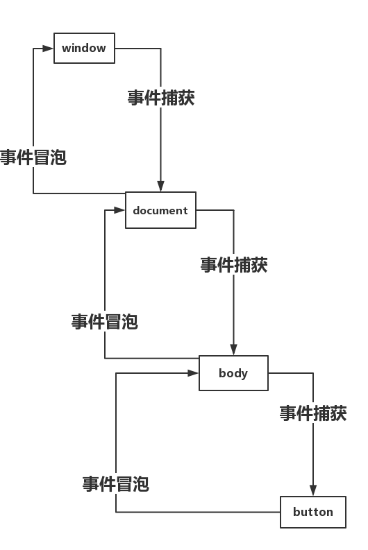

### 事件捕获和事件冒泡

在介绍两者之前首先需要了解监听器:

> `EventTarget.addEventListener()`：方法将指定的监听器注册到`EventTarget`上，当该对象触发指定的事件时，指定的回掉函数就会被执行。事件的目标可以是一个文档上的元素`Element,Document`和`Window`或者任何其他支持事件的对象（比如`XMLHttpRequest`）。
>
> 语法：
>
> ```js
> element.addEventListener(event,function,useCapture)
> ```
>
> - event（必需）：字符串，指定事件名。*注意不要使用"on"前缀，例如"onclick"应该使用"click"*
>
> - function（必需）：指定被监听的事件触发时所要执行的回掉函数。
>
> - useCapture（可选）：布尔值，指定事件是否在捕获或冒泡阶段执行。可能值：true :事件句柄在捕获阶段执行。false:默认。事件句柄在冒泡阶段执行。

```html
<script>
	document.getElementById("myBtn").addEventListener("click",callfunction,true); //事件捕获
    document.getElementById("myBtn").addEventListener("click",callfunction,false); //事件冒泡
    function callfunction(){
        document.getElementById("demo").innerHTML="hello world!"
    }
</script>
<body>
	<button id="myBtn">
        点击
    </button>
    <div id="demo">
    	
    </div>
</body>

```

**一个完整的事件流：从window开始，最后回到window的过程。**

1. ##### 事件捕获：window> document>body>button（从window开始一层一层到真正触发事件的元素）

2. ##### 事件冒泡：button>body>document>window（从当前触发事件的元素开始，一层一层冒泡到window）

3. ##### 两者刚好相反



##### 如何阻止事件冒泡/捕获和默认行为

```js
//jquery阻止默认行为和冒泡
$("#myBtn").on('click',function(){
    return false;
})
//js
let Obtn=document.getElementById("myBtn");
Obtn.onclick=function(e){
    let e=ev||event;
    //阻止事件冒泡  
    e.cancelBubble=true;
    e.stopPropagation();
    e.stopImmediatePropagation();
    //阻止默认行为，但不阻止冒泡
    e.preventDefault();
    return false;
}
```

*stoppropagation属于W3C标准，试用于Firefox等浏览器，但是不支持IE浏览器相反cancelBubble不符合W3C标准，而且只支持IE浏览器。所以很多时候，我们都要结合起来用。不过，cancelBubble在新版本chrome,opera浏览器中已经支持。*

**也可以使用新增事件stopImmediatePropagation()方法来阻止事件捕获和事件冒泡**

那么 stopImmediatePropagation() 和 stopPropagation()的区别在哪儿呢？

　　后者只会阻止冒泡或者是捕获。 但是前者除此之外还会阻止该元素的其他事件发生，但是后者就不会阻止其他事件的发生

##### 事件代理（事件委托）

**原理：利用事件的冒泡原理来实现的。处在深层的元素触发的事件，最终会冒泡到其父层上，在绑定事件时，利用这个原理，对其父级进行事件绑定。**

**举例：实现鼠标滑过，改变背景**

```html
<body>
    <ul>
        <li>li1</li>
        <li>li2</li>
        <li>li3</li>
    </ul>
</body>
```

**不使用事件代理：**

```js
$("li").on("mouseover",function(){
    $(this).css("background","red").siblings().css("background","white");
})
```

**使用事件代理：**

```js
$("ul").on("mouseover",function(e){
    let e=e||event;
    $(e.target).css("background","red").siblings().css("background","white");
})
```

**事件委托与事件不委托之间区别：**

1. 事件委托不需要遍历要操作的元素结点，事件不委托需要遍历要操作的元素结点
2. 事件委托减少操作dom的次数，对性能优化，事件不委托操作的dom次数较多
3. 事件委托所定义的事件，对新创建的元素结点也可起到作用，而不使用事件委托，对新添加的结点，需要重新为其绑定相关事件。

**event.target & event.currentTarget两者的区别**

```jsx
<div id="a">
  <div id="b">
    <div id="c"><div id="d"></div></div>
  </div>
</div>
<script>
  document.getElementById('a').addEventListener('click', function(e) {
    console.log(
      'target:' + e.target.id + '&currentTarget:' + e.currentTarget.id
    )
  })
  document.getElementById('b').addEventListener('click', function(e) {
    console.log(
      'target:' + e.target.id + '&currentTarget:' + e.currentTarget.id
    )
  })
  document.getElementById('c').addEventListener('click', function(e) {
    console.log(
      'target:' + e.target.id + '&currentTarget:' + e.currentTarget.id
    )
  })
  document.getElementById('d').addEventListener('click', function(e) {
    console.log(
      'target:' + e.target.id + '&currentTarget:' + e.currentTarget.id
    )
  })
</script>
```

当我们点击最里层的元素d的时候，会依次输出:

```js
target:d&currentTarget:d
target:d&currentTarget:c
target:d&currentTarget:b
target:d&currentTarget:a
```

从输出中我们可以看到，`event.target`指向引起触发事件的元素，而`event.currentTarget`则是事件绑定的元素，只有被点击的那个目标元素的`event.target`才会等于`event.currentTarget`。**也就是说，event.currentTarget始终是监听事件者，而event.target是事件的真正发出者**。