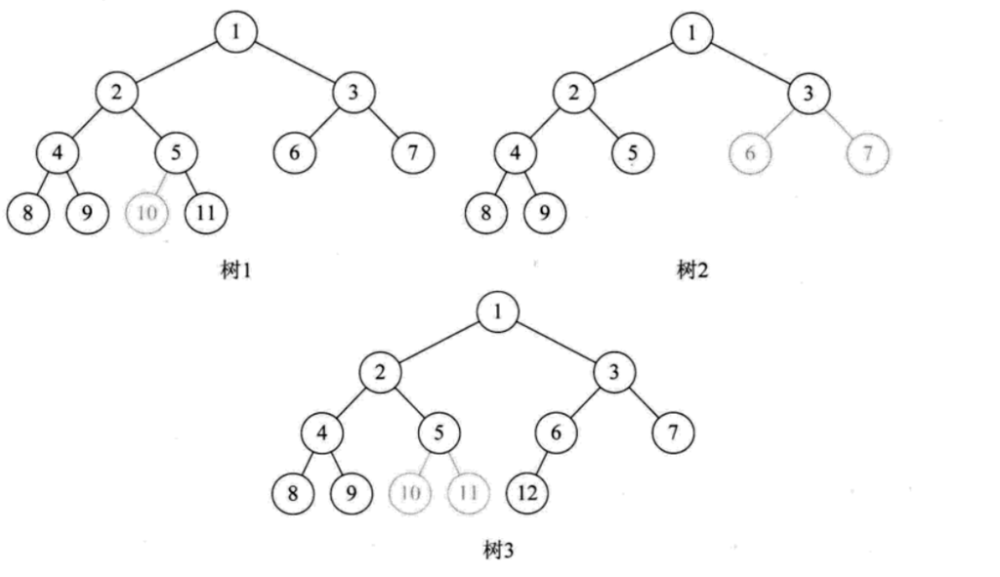
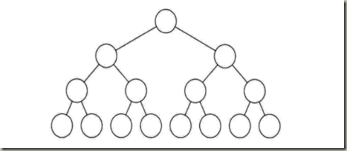
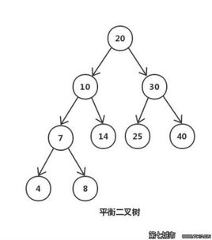
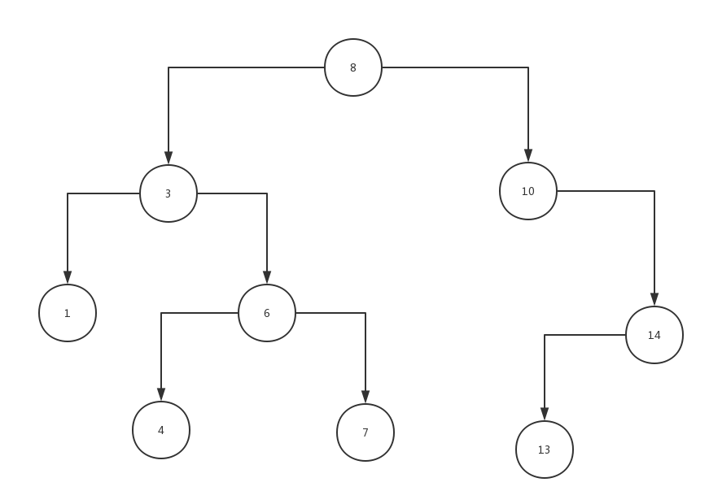

### 二叉树

**二叉树是一种典型的数据结构，是树的特殊一种。**

##### 特点：

1. 每个结点最多有两个子树，结点的度最大为2。

2. ##### 结点有左右之分，不能颠倒。

##### 相关概念：

1. **度：子树就是二叉树的分支，度就是分支的个数。**
2. **结点层：根结点的层定义为1，以此类推。**
3. **树的深度：树中最大的结点层。**
4. **叶子结点：度为0的结点。**

##### 二叉树又分为几种特殊情况：

- 完全二叉树：假设二叉树高度为h，从1~（h-1）层的结点个数达到最大，第h层有叶子结点，且从左到右依次排列，称为完全二叉树。

  

- 满二叉树：除了叶子结点外，所有结点都有左右子树，且所有叶子结点都处在最底层，称为满二叉树。

  

- 平衡二叉树（AVL树）：它的左右两个子树的高度差的绝对值不超过1，并且左右两个子树都是平衡二叉树。

  

##### 二叉树的三种遍历方式：

1. 中序遍历：左根右。
2. 前序遍历：根左右。
3. 后序遍历：左右根。

**代码实现**

```javascript
//构建排序二叉树
		function getTree(){
			//创建结点方法
			var node = function(key){
				this.key=key;
				this.left=null;
				this.right=null;
			}
			var root=null; //初始化根节点
			var insertTrees=function(node,newNode){	//插入结点
				if(node.key>newNode.key){
					if(node.left===null){
						node.left=newNode;
					}else{
						insertTrees(node.left,newNode);
					}
				}else{
					if(node.right===null){
						node.right=newNode;
					}else{
						insertTrees(node.right,newNode);
					}
				}
			};
			var zxSortSelect=function(node,callback){	//中序遍历方法
				if(node!==null){
					zxSortSelect(node.left,callback);
					callback(node.key);
					zxSortSelect(node.right,callback);
				}
			};
			var qxSortSelect=function(node,callback){	//前序遍历
				if(node!==null){
					callback(node.key);
					qxSortSelect(node.left,callback);
					qxSortSelect(node.right,callback);
				}
			};
			var hxSortSelect=function(node,callback){	//后序遍历
				if(node!==null){
					hxSortSelect(node.left,callback);
					hxSortSelect(node.right,callback);
					callback(node.key);
				}
			};
			var min=function(node){	//求最小值
				if(node!==null){
					while(node && node.left!==null){
						node=node.left;
					}
					return node.key;
				}
				return null;
			};
			var max=function(node){	//求最大值
				if(node!==null){
					while(node && node.right!==null){
						node=node.right;
					}
					return node.key;
				}
				return null;
			}
			var select=function(node,key){	//查找值
				if(node===null){
					return false;
				}
				if(node!==null){
					if(node.key>key){
						return select(node.left,key);
					}else if(node.key<key){
						return select(node.right,key);
					}else{
						return node;
					}
				}
			}
			var getmin=function(node){
				if(node!==null){
					while(node && node.left!==null){
						node=node.left;
					}
					return node;
				}
				return null;
			}
			var remove=function(node,key){	//删除值
				if(node===null){
					return false;
				}
				if(key<node.key){
					node.left=remove(node.left,key);
					return node;
				}else if(key>node.key){
					node.right=remove(node.right,key);
					return node;
				}else{
					if(node.left===null&&node.right===null){
						node=null;
						return node;
					}else if(node.left===null&&node.right!==null){
						node=node.right;
						return node;
					}else if(node.right===null&&node.left!==null){
						node=node.left;
						return node;
					}else{
						var zx=getmin(node.right);
						node.key=zx.key;
						node.right=remove(node.right,zx.key);
						return node;
					}
				}	
			}
			this.insert=function(key){
				var newNode=new node(key);
				if(root===null){
					root=newNode;
				}else{
					insertTrees(root,newNode);
				}
				// console.log(root);
			};
			//中序遍历
			this.zxSelect=function(callback){
				zxSortSelect(root,callback);
			};
			//前序遍历
			this.qxSelect=function(callback){
				qxSortSelect(root,callback);
			}
			//后序遍历
			this.hxSelect=function(callback){
				hxSortSelect(root,callback);
			}
			//查找最小值
			this.minKey=function(){
				return min(root);
			}
			//查找最大值
			this.maxKey=function(){
				return max(root);
			}
			//查询指定值
			this.selectKey=function(key){
				return select(root,key);
			}
			//删除值
			this.removeKey=function(key){
				root=remove(root,key);
			}
		}
```

**调用**

```javascript
var arr=[8,3,10,1,6,14,4,7,13];
var tree=new getTree();
arr.forEach(function(key,index){		//构建二叉树
    tree.insert(key);
});
tree.zxSelect(callback); //1,3,4,6,7,8,10,13,14
tree.qxSelect(callback); //8,3,1,6,4,7,10,14,13
tree.hxSelect(callback); //1，4，7，6，3，13，14，10，8
console.log('最小值：',tree.minKey());
console.log('最大值：',tree.maxKey());
console.log('查找值：',tree.selectKey(6));
tree.removeKey(14);
```

**构建好的二叉树：**

