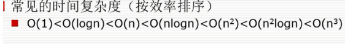

# 运用js实现简单的几种排序算法

#### 时间复杂度排序：

##### 如何分析时间复杂度

1. 只关注循环执行次数最多的一段代码。

   > 大o这种复杂度表示方法只是表示一种变化趋势，我们通常会忽略掉公式中的常量、低阶、系数，只需要记录一个最大阶的量级就可以了。

2. 加法法则：总复杂度等于量级最大的那段代码的复杂度。

3. 乘法法则：嵌套代码的复杂度等于嵌套内外代码复杂度的乘积。

##### 最好、最坏、平均、均摊时间复杂度

1. 最好时间复杂度：在最理想的情况下所执行代码的时间复杂度。
2. 最坏时间复杂度：在最糟糕的情况下所执行代码的时间复杂度。
3. 平均时间复杂度：加权平均时间复杂度。
4. 均摊时间复杂度：看能否将最高时间复杂度的那次操作平摊到其他那些时间复杂度比较低的操作上。一般均摊时间复杂度就等于最好情况时间复杂度。

### 二分查找(折半查找)

> #####算法思想：
	搜索过程从数组的中间元素开始，如果中间元素正好是要查找的元素，则搜索过程结束；如果某一特定元素大于或者小于中间元素，则在数组大于或小于中间元素的那一半中查找，而且跟开始一样从中间元素开始比较。如果在某一步骤数组为空，则代表找不到。这种搜索算法每一次比较都使搜索范围缩小一半。
***注意：查找必须是大小排好序的***
#### 时间复杂度：O(log2n)
##### 代码实现：
```javascript
	let arr=[1,2,3,4,5,6,7,8,9];
	function erfen(arr,val){
	 	let left=0;
	 	let right=arr.length-1;
	 	while(left<=right){
	 		let mid=parseInt((left+right)/2);
	 		if(val>arr[mid]){
	 			left=mid+1;
	 		}else if(val<arr[mid]){
	 			right=mid-1;
	 		}else{
	 			return mid;
	 		}
	 	}
	}
	let res=erfen(arr,1);
	console.log('二分查找：',res);
```
### 冒泡排序

> #####算法思想：
	1. 比较相邻的元素。如果第一个比第二个大，就交换他们两个。
	2. 对每一对相邻元素做同样的工作，从开始第一对到结尾的最后一对。在这一点，最后的元素应该会是最大的数。
	3. 针对所有的元素重复以上的步骤，除了最后一个。
	4. 持续每次对越来越少的元素重复上面的步骤，直到没有任何一对数字需要比较。 
#### 时间复杂度：O(n^2)
##### 代码实现：
```javascript
	function mp(arr){
	 	for(let i=0;i<arr.length-1;i++){
	 		for(let j=0;j<arr.length-i-1;j++){
	 			if(arr[j]>arr[j+1]){
	 				let tmp=arr[j];
	 				arr[j]=arr[j+1];
	 				arr[j+1]=tmp;
	 			}
	 		}
	 	}
	 	return arr;
	 }
	 res=mp(array);
	 console.log('冒泡排序：',res);
```
### 快速排序

> #####算法思想：
	1. 选出一个基准数，一般为第一个元素。
	2. 比较后边的所有数值，大的放右边，小的放左边（也就是一趟之后，将排序的数据分成两块，一部分是比基准数都小的，一部分是比基准数都大的）。
	3. 最后分别对两块数据进行重复1、2步骤。（递归进行）。
#### 时间复杂度：O(nlogn) 
##### 代码实现：
```javascript
	function kp(arr,left,right){
		if(left<right){
			let mid=q(arr,left,right);
			kp(arr,mid+1,right);
			kp(arr,left,mid-1);
		}
	}
	function q(arr,left,right){
		let tmp=arr[left];
		while(left<right){
			while(left<right&&tmp<=arr[right]){	//从右开始找
				right=right-1;
			}
			arr[left]=arr[right];	//找到比基准数小的放到左边
			while(left<right&&tmp>=arr[left]){	//从左开始找
				left++;
			}
			arr[right]=arr[left];	//找到比基准数大的放到右边
		}
		arr[left]=tmp;		//将基准数放到中间
		return left;
	}
	kp(array,0,array.length-1);
	console.log('快速排序：',array);
```

### 选择排序

> #####算法思想：
	每一次从待排序的数据元素中选出最小（或最大）的一个元素，存放在序列的起始位置，直到全部待排序的数据元素排完。 选择排序是不稳定的排序方法。
#### 时间复杂度：O(n^2) 
##### 代码实现：
```javascript
	function xz(arr){
		for(let i=0;i<arr.length;i++){
			let min = i;
			for(let j=i+1;j<arr.length;j++){
				if(arr[j]<arr[min]){
					min=j;
				}
			}
			if(min!=i){
				let tmp=arr[i];
				arr[i]=arr[min];
				arr[min]=tmp;
			}
		}
	}
	xz(array);
	console.log('选择排序：',array);
```

### 插入排序

> #####算法思想：
	输入一个元素，检查数组列表中的每个元素，将其插入到一个已经排好序的数列中的适当位置，使数列依然有序，当最后一个元素放入合适位置时，该数组排序完毕。
#### 时间复杂度：O(n^2) 
##### 代码实现：
```javascript
	function cr(arr){
		for(let i=1;i<arr.length;i++){
			let tmp=arr[i];
			let j=i-1;
			while(j>=0&&tmp<arr[j]){
				arr[j+1]=arr[j];
				j--;
			}
			arr[j+1]=tmp;
		}
	}
	cr(array);
	console.log('插入排序：',array);
```

